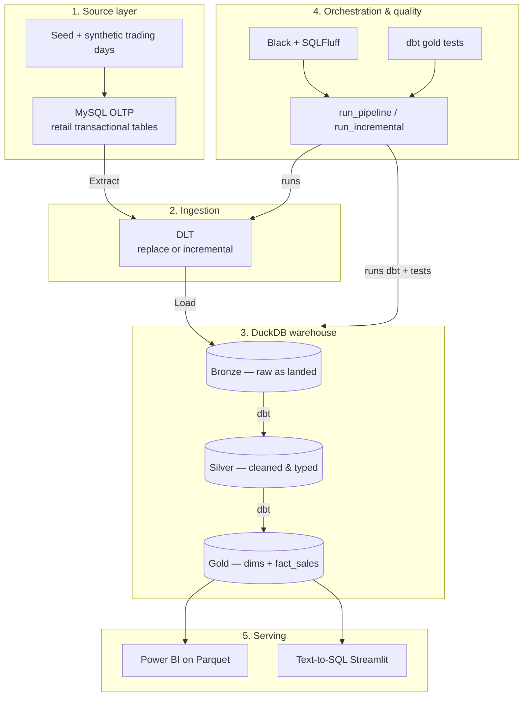

# Data architecture stack

Engineering stack for the Aussie retail medallion pipeline:

**MySQL OLTP → DLT → DuckDB → dbt (bronze / silver / gold) → Power BI + text-to-SQL**

Business context: [README](../README.md)  
Data shapes / ERD: [data-understanding.md](./data-understanding.md)  
Stakeholder products: [data-product.md](./data-product.md)

---

## Stack overview

| Layer | Technology | Responsibility |
|-------|------------|----------------|
| **1. OLTP source** | **MySQL** | Transactional retail tables (POS-style sales, product, staff, store, CRM, online orders). Seeded with synthetic dirty data. |
| **2. Ingestion** | **DLT** | Extract from MySQL into DuckDB `raw` (full replace or incremental merge) |
| **3. Warehouse** | **DuckDB** (`warehouse.duckdb`) | OLAP store for bronze / silver / gold |
| **4. Transform** | **dbt** | Bronze (raw) → silver (cleaned) → gold (`dim_*` + `fact_sales`) |
| **5. Orchestration** | **Python** (`orchestration/run_pipeline.py`, `run_incremental.py`) | Ingest → dbt run → gold tests → Parquet export |
| **6. Code quality** | **Black** + **SQLFluff** (DuckDB dialect) | Format Python; lint dbt SQL |
| **7. Serving** | **Power BI** + **text-to-SQL** (Streamlit + Gemini) | Dashboards and read-only questions on **gold only** |

---

## Architecture



---

## Component responsibilities

| # | Component | Tool | Responsibility |
|---|-----------|------|----------------|
| 1 | OLTP | MySQL | Hold source-shaped transactional data (including deliberate dirt) |
| 2 | Seed / generators | `mysql/seed.sql`, `synthetic/generate_trading_days.py` | Baseline seed + extra trading days for incremental demos |
| 3 | Ingestion | DLT | MySQL → DuckDB `raw` (replace or incremental) |
| 4 | Warehouse | DuckDB | Single local OLAP file for the medallion |
| 5 | Transform | dbt | Cleaning + star schema per [data-understanding](./data-understanding.md) |
| 6 | Quality | Black, SQLFluff, dbt tests | Format, lint, and validate gold |
| 7 | Orchestration | `orchestration/*.py` | Full or incremental end-to-end run |
| 8 | Serving | Power BI, text-to-SQL | Read from gold only |

---

## Repo layout

```text
ausie-retail-reporting/
├── mysql/                     # OLTP DDL + seed
├── synthetic/                 # Extra trading-day generator (incremental demos)
├── ingestion/                 # DLT: MySQL → DuckDB (replace / incremental)
├── orchestration/             # run_pipeline.py, run_incremental.py
├── dbt_model/                 # bronze / silver / gold + tests
├── duckdb_warehouse/          # warehouse.duckdb (gitignored binary)
├── powerbi/                   # Parquet export for Power BI
├── text2sql/                  # Gold-only ask-your-data (CLI + Streamlit)
├── docs/                      # Business-friendly design + product guides
└── README.md
```

---

## How this maps to our medallion

| Layer | In this project |
|-------|-----------------|
| **Bronze** | Raw landings of MySQL tables into DuckDB, aligned with [bronze schemas](./data-understanding.md#2-bronze-schemas-raw-contracts) |
| **Silver** | Dedupe helpers, GST both ways, UTC + local business date, customer match, return links, SCD prep |
| **Gold** | `dim_date`, `dim_location`, `dim_staff` (versions), `dim_product` (versions), `dim_customer`, `fact_sales` |

MySQL + DLT feed bronze; dbt builds silver and gold; Power BI and text-to-SQL consume gold.

---

## Scale note

Architecture and requirements target a mid-size retailer (~50 stores, ~8k SKUs, ~24 months). The demo warehouse uses a **smaller seed** plus optional multi-day synthetic inserts; growing volume does not require a new stack.
