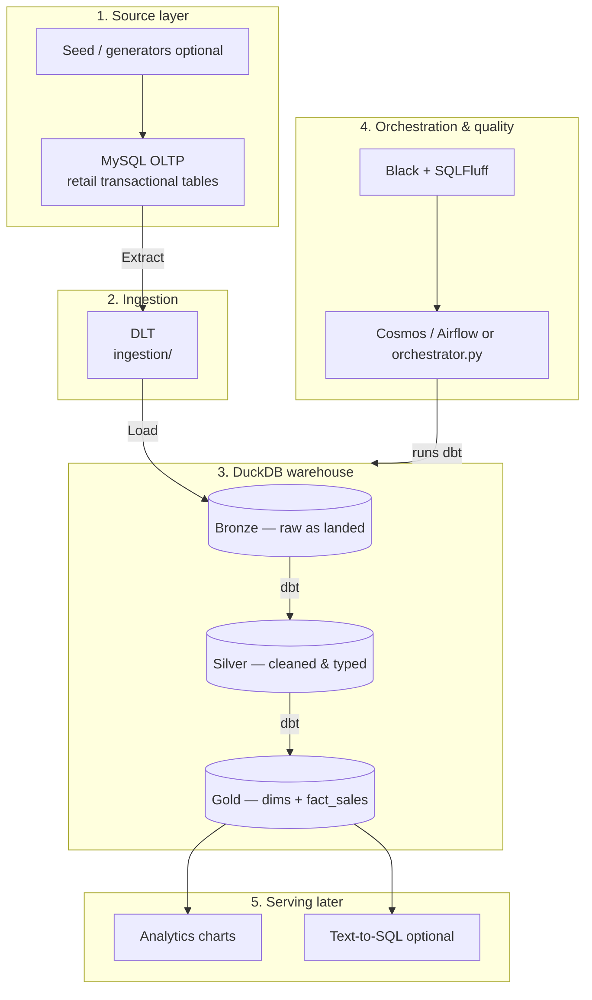

# Data architecture stack

Engineering stack for the Aussie retail medallion pipeline: **MySQL OLTP → DuckDB warehouse → dbt (bronze / silver / gold)**.

Business context: [README](../README.md)  
Data shapes / ERD: [data-understanding.md](./data-understanding.md)

---

## Stack overview

| Layer | Technology | Responsibility |
|-------|------------|----------------|
| **1. OLTP source** | **MySQL** | Transactional retail tables (POS-style sales, product, staff, store, CRM, online orders). Can be seeded with synthetic / AI-generated dirty data. |
| **2. Ingestion** | **DLT** (Data Load Tool) | Extract from MySQL and load into DuckDB bronze |
| **3. Warehouse** | **DuckDB** (`warehouse.duckdb`) | OLAP store for bronze / silver / gold |
| **4. Transform** | **dbt** | Bronze (raw) → Silver (cleaned) → Gold (`dim_*` + `fact_sales`) |
| **5. Code quality** | **Black** + **SQLFluff** (DuckDB dialect) | Format Python; lint dbt SQL |
| **6. Orchestration** | Astronomer Cosmos / Airflow or `orchestrator.py` | Run ingest → dbt → (later) charts |
| **7. Serving (later)** | Charts; optional text-to-SQL | Query **gold** only |

---

## Target architecture



---

## Component responsibilities

| # | Component | Tool | Responsibility |
|---|-----------|------|----------------|
| 1 | OLTP | MySQL | Hold source-shaped transactional data (including deliberate dirt for a realistic pipeline) |
| 2 | Seed (optional) | Python / AI generators | Populate MySQL with Aussie retail–like volumes and flaws |
| 3 | Ingestion | DLT | MySQL → DuckDB bronze |
| 4 | Warehouse | DuckDB | Single local OLAP file for the medallion |
| 5 | Transform | dbt | Cleaning + star schema per [data-understanding](./data-understanding.md) |
| 6 | Quality | Black, SQLFluff | Python format; SQL lint |
| 7 | Orchestration | Cosmos/Airflow or `orchestrator.py` | End-to-end run |
| 8 | Serving | Charts / optional T2S | Read from gold |

---

## Planned repo layout

```text
ausie-retail-reporting/
├── mysql/                     # OLTP DDL (Workbench / mysql client)
│   └── ddl.sql
├── ingestion/                 # DLT: MySQL → DuckDB bronze
├── orchestration/             # ingest + dbt (+ later charts)
├── dbt_model/                 # bronze / silver / gold SQL
│   ├── models/
│   ├── macros/
│   ├── seeds/
│   ├── tests/
│   ├── profiles.yml
│   └── dbt_project.yml
├── duckdb_warehouse/          # warehouse.duckdb (gitignored binary)
├── generators/                # optional: seed MySQL with synthetic dirty data
├── docs/
│   ├── data-understanding.md
│   └── data-architecture-stack.md
└── README.md
```

Optional later: `text2sql/`, chart generation under `docs/`.

---

## How this maps to our medallion

| Layer | In this project |
|-------|-----------------|
| **Bronze** | Raw landings of MySQL tables into DuckDB, aligned with [bronze schemas](./data-understanding.md#2-bronze-schemas-raw-contracts) |
| **Silver** | Dedupe, GST both ways, UTC + local business date, customer match, late merge, return links, SCD prep |
| **Gold** | `dim_date`, `dim_location`, `dim_staff` (versions), `dim_product` (versions), `dim_customer`, `fact_sales` |

MySQL + DLT feed bronze; dbt builds silver and gold.

---

## Build order

1. Scaffold folders + `requirements.txt` / Makefile  
2. MySQL schema (OLTP tables matching bronze contracts)  
3. DuckDB + dbt project skeleton  
4. DLT ingest MySQL → bronze  
5. Optional generators to seed MySQL  
6. Silver rules one dirt-type at a time  
7. Gold dims (SCD2 staff/product) + `fact_sales`  
8. Orchestrator / `run-all`  
9. Charts (T2S optional)

---

## Next

Scaffold the stack (MySQL + DLT + DuckDB + dbt skeleton) once this stack doc stays stable.
