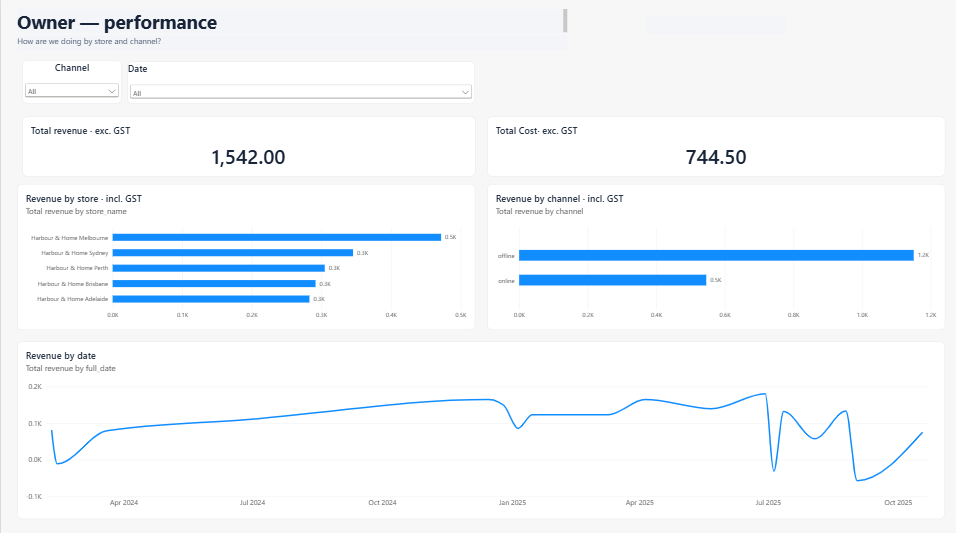
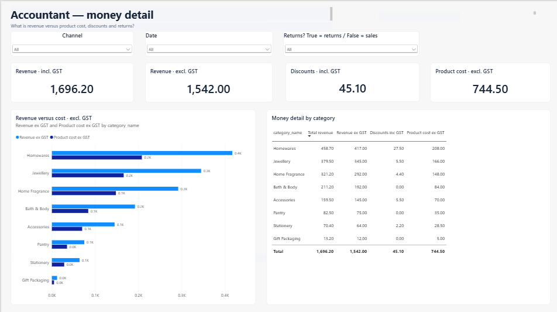

# Data product (business guide)

This guide explains **what stakeholders open**, **which business questions each view answers**, and **how those products meet the project requirements**.

It is written for a **business reader** (owner, accountant, reviewer). Pipeline detail lives in the other guides.

| Related guide | Role |
|---------------|------|
| [README](../README.md) | Business context, requirements (R1–R9), use cases (UC1–UC5) |
| [data-understanding.md](./data-understanding.md) | Raw data shape and gold reporting model |
| [data-architecture-stack.md](./data-architecture-stack.md) | End-to-end technical stages |
| [data-transformation.md](./data-transformation.md) | Cleaning, gold, and quality checks in business terms |

---

## 1. What the data product is

After shop-system data is landed, cleaned, and tested, stakeholders do **not** read MySQL or bronze tables.

They consume **gold** — one sales fact plus dimensions — in two ways:

| Product | Tool | Who | Purpose |
|---------|------|-----|---------|
| **Dashboard** | Power BI (`.pbix` on gold Parquet) | Owner, accountant | Agreed visuals for store, channel, category, and money detail |
| **Ask your data** | Streamlit + Gemini (read-only) | Analyst (optional for owner) | One-off questions in plain English on the **same** gold numbers |

Both products read **gold only**, so dashboard totals and chat answers stay aligned.

```text
Gold (fact_sales + dims)
    ├── Parquet export → Power BI     (UC2, UC3)
    └── Text-to-SQL (Streamlit)      (UC4)
```

---

## 2. Use cases lined to requirements

| Use case | Who | What they do | Requirements met |
|----------|-----|--------------|------------------|
| **UC1 — Trusted daily refresh** | Data / ops | Run one pipeline: ingest → rebuild → gold tests → Parquet export | R2, R3, R4, R6 |
| **UC2 — Owner performance view** | Owner | Power BI page: revenue by store, channel, and date | R4, R5, R7 |
| **UC3 — Accountant / finance view** | Accountant | Power BI page: revenue, cost, discount, returns by category | R3, R4, R7 |
| **UC4 — Ad-hoc ask-your-data** | Analyst | Streamlit questions on gold only (read-only) | R4, R8 |
| **UC5 — Readable design pack** | Business reader | This guide plus understanding / architecture / transformation docs | R9 |

---

## 3. Power BI dashboards (delivered)

The `.pbix` is built on the gold star (`fact_sales` joined to location, product, date, and related dims). Two report pages match **UC2** and **UC3**.

### 3.1 Owner — performance (UC2)

**Business question:** *How are we doing by store and channel?*



| Component | What it shows |
|-----------|----------------|
| Slicers | Channel, Date |
| Card | Total revenue (ex GST) |
| Card | Total cost (ex GST) |
| Bar chart | Revenue by store (inc GST) |
| Bar chart | Revenue by channel (inc GST) — offline vs online |
| Line chart | Revenue by date |

**Requirements met:** R4 (reporting model), R5 (store vs online in one place), R7 (owner dashboard).

### 3.2 Accountant — money detail (UC3)

**Business question:** *What is revenue versus product cost, discounts and returns?*



| Component | What it shows |
|-----------|----------------|
| Slicers | Channel, Date, Returns (True = returns / False = sales) |
| Card | Revenue — incl. GST |
| Card | Revenue — excl. GST |
| Card | Discounts — incl. GST |
| Card | Product cost — excl. GST |
| Clustered bar | Revenue vs cost (ex GST) by product category |
| Table | Money detail by category (revenue, revenue ex GST, discounts, product cost) |

**Requirements met:** R3 (cleaned GST / returns-ready figures), R4 (fact + product dim), R7 (accountant dashboard).

---

## 4. Ask your data (UC4)

**Business question:** *Can we answer a one-off question without rebuilding the report?*

| Piece | Role |
|-------|------|
| Streamlit | Simple browser form (question, suggestions, results table) |
| Gemini | Drafts one SQL statement from the gold schema description |
| Python executor | Allows **read-only SELECT** on **`main_gold` only**, then runs it on DuckDB |
| Result | Table on screen (optional “Show SQL”) |

Stakeholders should treat Power BI as the **agreed** view. Ask-your-data is for exploration on the **same** gold layer — not a second source of truth.

**Requirements met:** R4, R8.

How to open (local machine, venv on):

```bat
streamlit run text2sql\app.py
```

Needs `GEMINI_API_KEY` in local `.env`. The app runs only while the laptop process is running.

---

## 5. How to refresh the product (UC1)

After MySQL shop data changes (or on a daily-style schedule):

```bat
python orchestration\run_pipeline.py
```

That run:

1. Copies MySQL → DuckDB  
2. Rebuilds bronze / silver / gold (dbt)  
3. Runs gold quality checks (stops if checks fail)  
4. Exports gold tables to `powerbi/export/*.parquet`  

Then refresh the Power BI file against those Parquet files so Owner and Accountant pages pick up new numbers.

**Requirements met:** R2, R3, R4, R6.

---

## 6. One truth — why Power BI and chat match

| Layer | Stakeholder meaning |
|-------|---------------------|
| Bronze / silver | Pipeline only — not for owner/accountant screens |
| **Gold** | Published reporting model |
| Power BI | Visuals on gold Parquet |
| Ask your data | Questions on gold in DuckDB |

If a chat answer and a dashboard card disagree, fix gold (or the measure), not two separate spreadsheets.

---

## 7. Quick checklist for a demo

1. Pipeline has been run successfully (`orchestration/run_pipeline.py`).  
2. Open the Power BI file → **Owner — performance** and **Accountant — money detail**.  
3. Optional: `streamlit run text2sql\app.py` → ask e.g. “Which store had the highest revenue?”  
4. Point reviewers at this guide plus the three design docs under `docs/`.
