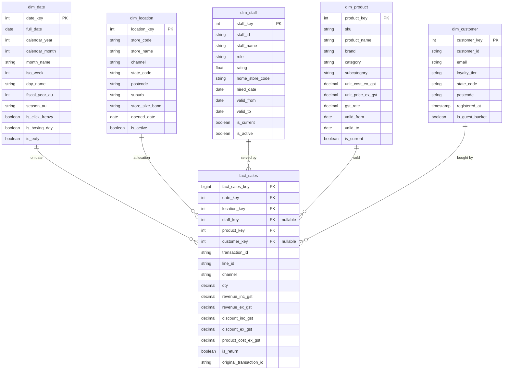

# Data understanding

This doc describes the **data** for the synthetic Aussie retail project: what we generate for the **bronze (raw)** layer, how we plan to turn it into **facts and dims**, and the target **ERD** (crow’s foot). No pipeline code yet.

Layers in plain words:

| Layer | Name | Meaning |
|-------|------|---------|
| Raw | **Bronze** | Data as if it came from POS / ERP / CRM / online — messy on purpose |
| Cleaned | **Silver** | Deduped, GST fixed, timezones fixed, customers matched, history tracked |
| Reporting | **Gold** | Star schema: one sales **fact** + **dimensions** for dashboards |

---

## 1. Bronze sources (what lands raw)

Bronze is the **raw landing** of transactional extracts. Upstream OLTP is **MySQL** (tables seeded with synthetic / AI-generated dirty Aussie retail data when we do not have a live retailer).

Source domains in MySQL (then extracted to DuckDB bronze):

1. **POS** — in-store sales lines (GST-inclusive prices, local timestamps, retries/duplicates)
2. **ERP product master** — products (ex-GST cost/price, hierarchy that changes over time)
3. **CRM** — loyalty customers (near-duplicate emails, casing issues)
4. **Online (Shopify-style)** — web orders + lines (guest checkout → null customer)
5. **Store directory** — store attributes (messy state codes; includes online as a channel)
6. **Staff** — HR/POS staff versions (role/position changes over time)

Generators may populate MySQL; **DLT** loads MySQL → DuckDB bronze.

---

## 2. Bronze schemas (raw contracts)

Types are logical (what the column means). Physical types (CSV/Parquet) come later.

### 2.1 `bronze_store`

One row per store / channel location as ops might export it.

| Column | Description |
|--------|-------------|
| `store_code` | Business code (e.g. `SYD-01`, `ONLINE`) |
| `store_name` | Display name |
| `channel` | e.g. `offline` / `online` (may be inconsistent casing) |
| `state_raw` | Messy: `NSW`, `N.S.W.`, `New South Wales`, … |
| `postcode` | May disagree with state |
| `suburb` | Free text |
| `store_size_band` | e.g. S/M/L — drives synthetic volume |
| `opened_date` | Local calendar date |
| `is_active` | Y/N or true/false mix allowed in bronze |
| `source_extracted_at` | When this file was landed |

### 2.2 `bronze_pos_transaction`

In-store POS line (grain: one product line on a receipt). **GST-inclusive** money amounts.

| Column | Description |
|--------|-------------|
| `transaction_id` | POS id — **can duplicate** on network retry |
| `line_id` | Line on the receipt |
| `store_code` | Ties to store directory |
| `txn_timestamp_local` | Local time **without timezone offset** |
| `staff_id` | Cashier id as POS knows it |
| `staff_name` | Often denormalised on the ticket |
| `product_sku` | SKU scanned |
| `qty` | Positive sale; negative = return |
| `unit_price_inc_gst` | Sell price including GST |
| `discount_inc_gst` | Discount including GST |
| `line_total_inc_gst` | Line total including GST |
| `return_of_transaction_id` | Null for sales; set for returns (may point to older period) |
| `payment_type` | cash / eftpos / card / … (free text) |
| `pos_batch_id` | File/batch id (late files land days later) |
| `source_extracted_at` | Landing time (can be after business day) |

### 2.3 `bronze_erp_product`

Product master from ERP. Money is **ex-GST**. Hierarchy can change mid-year (same SKU, new category in a later extract).

| Column | Description |
|--------|-------------|
| `sku` | Product code |
| `product_name` | Name |
| `brand` | Brand |
| `category` | Level 1 |
| `subcategory` | Level 2 |
| `unit_cost_ex_gst` | Cost excluding GST |
| `unit_price_ex_gst` | List price excluding GST |
| `gst_rate` | e.g. `0.10` |
| `effective_from` | When this version of the row starts |
| `effective_to` | Null if current; set when reclassified |
| `is_active` | Active flag |
| `source_extracted_at` | Extract timestamp |

### 2.4 `bronze_crm_customer`

Loyalty CRM export. Near-duplicates expected (same email, different casing/spacing).

| Column | Description |
|--------|-------------|
| `customer_id` | CRM id |
| `email` | May differ only by case/spaces |
| `phone` | Optional, messy formatting |
| `first_name` | |
| `last_name` | |
| `postcode` | |
| `state_raw` | Same mess as stores |
| `loyalty_tier` | e.g. bronze/silver/gold (loyalty, not medallion) |
| `registered_at` | |
| `source_extracted_at` | |

### 2.5 `bronze_online_order` (header)

| Column | Description |
|--------|-------------|
| `order_id` | Online order id |
| `order_timestamp_utc` | Platform time (often UTC — unlike POS) |
| `customer_id` | Null for **guest** checkout |
| `email` | Often present even when guest |
| `ship_state_raw` | Messy state |
| `ship_postcode` | |
| `currency` | `AUD` |
| `order_status` | paid / refunded / … |
| `source_extracted_at` | |

### 2.6 `bronze_online_order_line`

| Column | Description |
|--------|-------------|
| `order_id` | FK-like to header |
| `line_id` | |
| `product_sku` | |
| `qty` | Negative for returns/refunds |
| `unit_price_inc_gst` | Web price often inc GST |
| `discount_inc_gst` | |
| `line_total_inc_gst` | |
| `return_of_order_id` | Optional link to original order |
| `source_extracted_at` | |

### 2.7 `bronze_staff` (POS / HR export)

Staff change over time (name corrections, **role/position**, home store, rating). Bronze may ship multiple versions per `staff_id`, same idea as ERP product extracts.

| Column | Description |
|--------|-------------|
| `staff_id` | Stable person id |
| `staff_name` | May change (typo fix / preferred name) |
| `home_store_code` | May change on transfer |
| `role` | cashier / supervisor / … — **changes with promotion** |
| `rating` | May change over time |
| `hired_date` | Usually fixed |
| `effective_from` | When this version starts |
| `effective_to` | Null if current; set when superseded |
| `is_active` | |
| `source_extracted_at` | |

---

## 3. Transform plan (bronze → silver → gold)

### Bronze → Silver (cleaning)

| Problem in bronze | Silver rule (brief) |
|-------------------|---------------------|
| Duplicate `transaction_id` (+ line) | Keep one row (e.g. latest `source_extracted_at`) |
| POS inc-GST vs ERP ex-GST | Compute ex-GST and inc-GST amounts; store both with clear names |
| POS local time, no offset | Map `store_code` → timezone; write `txn_ts_utc` + `business_date_local` |
| Late batches | Merge by business key; incremental upsert, not “replace whole history” only |
| Guest + CRM email dupes | Resolve customer key; allow null for true guests; match emails case-insensitive |
| Returns | Keep negative qty; link `original_transaction_key` when present |
| Product name / price / category change | **SCD2** `dim_product`: one row per SKU **version** (`valid_from` / `valid_to` / `is_current`) |
| Staff role / name / home store / rating change | **SCD2** `dim_staff`: one row per staff **version** (same versioning pattern) |
| Messy state / postcode | Conform to standard AU state code; flag mismatches |

Silver outputs conformed tables (cleaned transactions, cleaned products, resolved customers, stores, staff) — still not the final star names if you prefer, but **keys are stable**.

### Silver → Gold (facts & dims)

| Gold table | Built from | Grain / role |
|------------|------------|--------------|
| `dim_date` | Calendar generator | One day; AU FY attributes optional |
| `dim_location` | `bronze_store` → silver store | One store/channel location |
| `dim_staff` | `bronze_staff` (SCD2) | One staff **version** (role/name/store as-at that period) |
| `dim_product` | ERP product silver (SCD2) | One SKU **version** (name/price/category as-at that period) |
| `dim_customer` | CRM + online email resolution | One resolved customer (guest unknown) |
| `fact_sales` | POS lines + online lines | **One sale/return line** |

**Point-in-time keys:** when building `fact_sales`, pick `product_key` and `staff_key` for the version where `business_date_local` falls in `[valid_from, valid_to)`. So a sale in March points at the March product price/name and the cashier’s role in March — not “whatever is current today”.

`fact_sales` measures (conceptually):

- `qty`
- `revenue_inc_gst` / `revenue_ex_gst`
- `discount_inc_gst` / `discount_ex_gst`
- `product_cost_ex_gst` (from the **product version** valid on the business date)
- FKs: `date_key`, `location_key`, `staff_key`, `product_key`, `customer_key` (nullable)
- Degenerate / refs: `transaction_id`, `line_id`, `channel`, `is_return`, `original_transaction_id`

Online rows: `staff_key` null; `location_key` = online location.

---

## 4. Target ERD (crow’s foot) — Gold reporting model

This is the model we design **before code**. Crow’s foot: `||` one, `o{` many.

### Crow’s foot summary

| Parent | Child | Relationship |
|--------|-------|--------------|
| `dim_date` | `fact_sales` | **1-to-many** — one date has many sale lines |
| `dim_location` | `fact_sales` | **1-to-many** |
| `dim_staff` | `fact_sales` | **1-to-many** (optional on online); FK is to a **staff version** |
| `dim_product` | `fact_sales` | **1-to-many**; FK is to a **product version** |
| `dim_customer` | `fact_sales` | **1-to-many** (optional for guest) |

Same person (`staff_id`) or same SKU (`sku`) can appear as **many rows** in the dim (one per version). Facts point at the version that was true on the sale date.

Bronze tables are **not** normalised like this on purpose; they are source-shaped. The ERD above is the **gold** target the transforms aim at.

---

## 5. Suggested build order (still design → then code)

1. Agree this doc (bronze columns + gold ERD)
2. Freeze sample volumes (e.g. 50 stores, 8k SKUs, 24 months)
3. Generate bronze synthetic files
4. Implement silver rules one dirt-type at a time
5. Build gold dims + `fact_sales`
6. Only then: dashboard / SQL examples

---

## 6. Decisions (locked)

| Choice | Decision |
|--------|----------|
| **Product history** | Full **version rows** in `dim_product` (SCD2): name, category, prices/costs change over time |
| **Staff history** | Full **version rows** in `dim_staff` (SCD2): name, **role/position**, home store, rating change over time |
| **Fact keys** | `fact_sales` uses the product/staff version valid on `business_date_local` |
| **Staff on online sales** | `staff_key` **null** |
| **Guest customers** | `customer_key` **null** (optional unused guest bucket row allowed later) |
